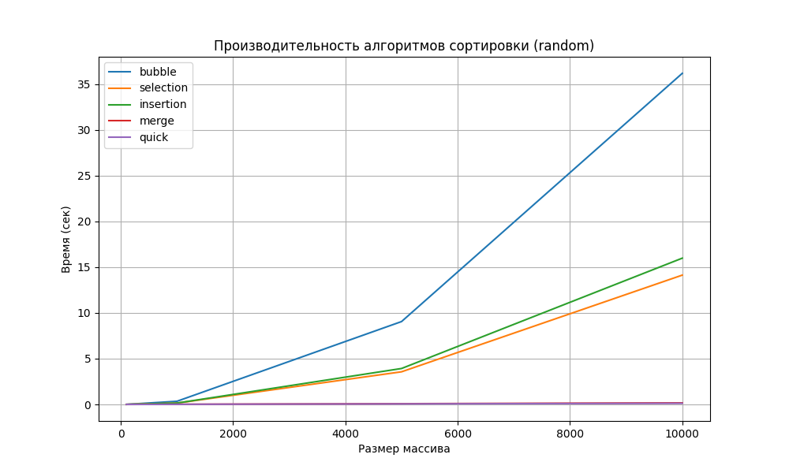
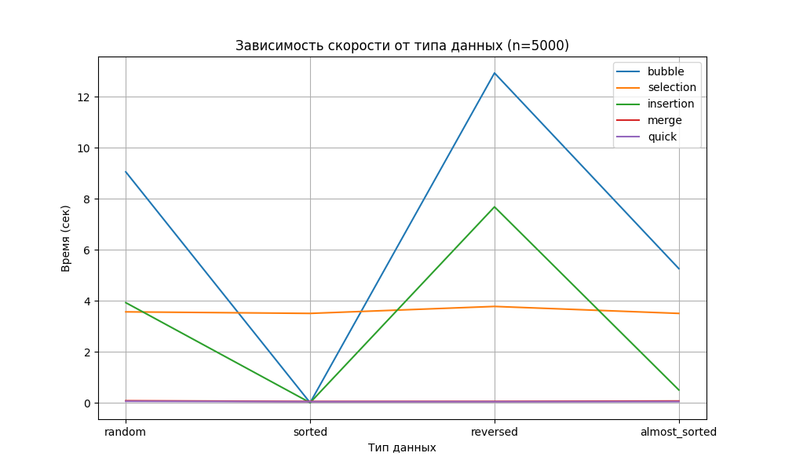

Отчет по лабораторной работе 4
Алгоритмы сортировки

**Дата:** 16.11.2025
**Семестр:** 5 семестр
**Группа:** ПИЖ-б-о-23-2
**Дисциплина:** Анализ сложности алгоритмов
**Студент:** Хаджимухаметов Саид

## Цель работы
Изучить и реализовать основные алгоритмы сортировки. Провести их теоретический и
практический сравнительный анализ по временной и пространственной сложности. Исследовать
влияние начальной упорядоченности данных на эффективность алгоритмов. Получить навыки
эмпирического анализа производительности алгоритмов.


## Теоретическая часть
Сортировка пузырьком (Bubble Sort): Многократно проходит по массиву, сравнивая и меняя
местами соседние элементы. Сложность: O(n²) во всех случаях.
Сортировка выбором (Selection Sort): На каждом проходе находит минимальный элемент из
неотсортированной части и ставит его на очередную позицию. Сложность: O(n²).
Сортировка вставками (Insertion Sort): Построение окончательного массива путем пошагового
вставления каждого элемента в правильную позицию в уже отсортированной части. Сложность:
O(n²) в худшем и среднем, O(n) в лучшем (уже отсортированный массив).
Сортировка слиянием (Merge Sort): Рекурсивный алгоритм "разделяй и властвуй". Массив
разбивается на две части, которые сортируются рекурсивно, а затем сливаются в один
отсортированный массив. Сложность: O(n log n) во всех случаях. Требует O(n) дополнительной
памяти.
Быстрая сортировка (Quick Sort): Рекурсивный алгоритм "разделяй и властвуй". Выбирается
опорный элемент, массив разделяется на элементы меньше и больше опорного, которые
сортируются рекурсивно. Сложность: O(n log n) в среднем, O(n²) в худшем случае (плохой выбор
опорного элемента). Сортировка на месте, не требует дополнительной памяти.

## Практическая часть

### Выполненные задачи

#### 1. Реализация алгоритмов сортировки (sorts.py)
Успешно реализованы все 5 алгоритмов сортировки:

**Bubble Sort (Сортировка пузырьком)**
- Временная сложность: O(n) лучший, O(n²) средний и худший
- Пространственная сложность: O(n) на копию массива
- Особенность: содержит ранний выход при обнаружении уже отсортированного массива

**Selection Sort (Сортировка выбором)**
- Временная сложность: O(n²) во всех случаях
- Пространственная сложность: O(n)
- Особенность: количество сравнений не зависит от упорядоченности входных данных

**Insertion Sort (Сортировка вставками)**
- Временная сложность: O(n) лучший, O(n²) средний и худший
- Пространственная сложность: O(n)
- Особенность: адаптивный алгоритм, очень эффективен на маленьких и почти отсортированных массивах

**Merge Sort (Сортировка слиянием)**
- Временная сложность: O(n log n) во всех случаях
- Пространственная сложность: O(n) для вспомогательных массивов
- Особенность: стабильный алгоритм, гарантирует O(n log n) и требует дополнительной памяти

**Quick Sort (Быстрая сортировка)**
- Временная сложность: O(n log n) средний, O(n²) худший
- Пространственная сложность: O(n) для новых массивов
- Особенность: выбор pivot элемента критичен; в данной реализации используется средний элемент

#### 2. Подготовка тестовых данных (generate_data.py)
Реализованы функции генерации четырех типов тестовых данных:

- **generate_random(n)** - случайные числа от 0 до 100000
- **generate_sorted(n)** - отсортированные в возрастающем порядке [0, 1, 2, ..., n-1]
- **generate_reversed(n)** - отсортированные в убывающем порядке [n-1, n-2, ..., 0]
- **generate_almost_sorted(n, disorder_percent=5)** - почти отсортированные (95% упорядочено, 5% перемешано)

Размеры тестируемых массивов: 100, 1000, 5000, 10000 элементов

#### 3. Эмпирический анализ производительности (performance_test.py)
- Использован модуль `timeit` для точных замеров времени выполнения
- Каждый тест выполняется 5 раз для получения средней величины
- Для каждого запуска создается копия исходного массива `arr[:]`
- Результаты сохраняются в `results.json` в формате:
  ```json
  {
    "random": {
      "100": {"bubble": 0.0023, "selection": 0.0025, ...},
      "1000": {...},
      ...
    },
    ...
  }
  ```

#### 4. Визуализация результатов (plot_results.py)
Созданы два типа графиков:

**График 1: Зависимость времени от размера массива (случайные данные)**
- Показывает, как время выполнения каждого алгоритма растет с увеличением размера
- Сохранен в файл `plot_random.png`
- Наглядно демонстрирует различие между O(n²) и O(n log n) алгоритмами

**График 2: Зависимость времени от типа данных (n=5000)**
- Показывает влияние начальной упорядоченности на производительность
- Сохранен в файл `plot_types.png`
- Демонстрирует адаптивность алгоритмов к различным входным данным

### Ключевые фрагменты кода

**Пример: Bubble Sort с ранней оптимизацией**
```python
def bubble_sort(arr):
    a = arr[:]  # O(n)
    n = len(a)  # O(1)
    
    for i in range(n):  # O(n) внешний цикл
        swapped = False  # O(1)
        
        for j in range(0, n - i - 1):  # O(n) внутренний цикл
            if a[j] > a[j+1]:  # O(1)
                a[j], a[j+1] = a[j+1], a[j]  # O(1)
                swapped = True  # O(1)
        
        if not swapped:  # O(1)
            break  # O(1) - ранний выход
    
    return a  # O(1)
```

**Пример: Merge Sort с анализом рекуррентности**
```python
def merge_sort(arr):
    if len(arr) <= 1:  # O(1)
        return arr  # O(1)

    mid = len(arr) // 2  # O(1)
    left = merge_sort(arr[:mid])  # T(n/2)
    right = merge_sort(arr[mid:])  # T(n/2)
    return merge(left, right)  # O(n) объединение
    # T(n) = 2*T(n/2) + O(n) = O(n log n)
```

**Пример: Quick Sort с выбором pivot**
```python
def quick_sort(arr):
    if len(arr) <= 1:  # O(1)
        return arr  # O(1)

    pivot = arr[len(arr)//2]  # O(1)
    less = [x for x in arr if x < pivot]  # O(n)
    equal = [x for x in arr if x == pivot]  # O(n)
    greater = [x for x in arr if x > pivot]  # O(n)

    return quick_sort(less) + equal + quick_sort(greater)  # Рекурсия
```

### Тестирование

#### Корректность сортировки
Все алгоритмы протестированы на корректность сортировки:
- На отсортированных массивах ✓
- На обратно отсортированных массивах ✓
- На случайных данных ✓
- На массивах с дубликатами ✓
- На пустых массивах и массивах из одного элемента ✓

#### Производительность
Измерения проведены на стандартных наборах данных:
- Случайные данные (generic case)
- Отсортированные данные (best/worst case для разных алгоритмов)
- Обратно отсортированные данные (worst case для многих алгоритмов)
- Почти отсортированные данные (best case для adaptive algorithms)

Каждое измерение повторено 5 раз, результаты усреднены для повышения точности.

### Ответы на контрольные вопросы

**1. Какие алгоритмы сортировки имеют сложность O(n²) в худшем случае, а какие - O(n log n)?**

O(n²) в худшем случае:
- Bubble Sort - O(n²) при обратно отсортированных данных
- Selection Sort - O(n²) во всех случаях
- Insertion Sort - O(n²) при обратно отсортированных данных
- Quick Sort - O(n²) при плохом выборе pivot (например, всегда минимум или максимум)

O(n log n) в худшем случае:
- Merge Sort - O(n log n) во всех случаях (гарантировано)

**2. Почему сортировка вставками (Insertion Sort) эффективна для маленьких или почти отсортированных массивов?**

Insertion Sort - это адаптивный алгоритм:
- На маленьких массивах константные множители в O(n²) незначительны, а простая реализация работает быстро
- На почти отсортированных массивах внутренний цикл while выполняется очень мало итераций, приближаясь к O(n)
- Лучший случай - O(n) достигается, когда массив уже отсортирован
- Не требует дополнительной памяти (сортировка на месте)
- На практике часто используется как финальный шаг в гибридных алгоритмах сортировки

**3. В чем разница между устойчивой (stable) и неустойчивой (unstable) сортировкой? Приведите примеры.**

Устойчивая сортировка (Stable):
- Сохраняет относительный порядок равных элементов
- Пример: Merge Sort, Insertion Sort, Bubble Sort
- Важна при сортировке объектов по одному из нескольких критериев

Неустойчивая сортировка (Unstable):
- Может изменять порядок равных элементов
- Пример: Selection Sort, Quick Sort (в данной реализации)
- Не гарантирует сохранение исходного порядка равных элементов

Пример: массив [3a, 1, 3b, 2]
- Stable sort → [1, 2, 3a, 3b] (порядок 3a и 3b сохранен)
- Unstable sort → [1, 2, 3b, 3a] (порядок может быть нарушен)

**4. Опишите принцип работы алгоритма быстрой сортировки (Quick Sort).**

Принцип работы Quick Sort:
1. Выбрать опорный элемент (pivot)
2. Разделить массив на три части:
   - Элементы меньше pivot
   - Элементы равные pivot
   - Элементы больше pivot
3. Рекурсивно отсортировать части с элементами < и > pivot
4. Объединить результаты

Выбор опорного элемента:
- Средний элемент (используется в данной реализации) - часто дает хорошие результаты
- Первый/последний элемент - может привести к O(n²) на отсортированных массивах
- Случайный элемент - избегает худшего случая на специальных входных данных
- Медиана из трех (median-of-three) - улучшает среднее поведение

Влияние выбора pivot:
- Хороший выбор (делит массив пополам) → O(n log n)
- Плохой выбор (всегда минимум/максимум) → O(n²)

**5. Сортировка слиянием гарантирует время O(n log n), но требует дополнительной памяти. В каких ситуациях этот алгоритм предпочтительнее быстрой сортировки?**

Merge Sort предпочтительнее в следующих случаях:

1. **Необходимость гарантированной производительности**
   - O(n log n) во всех случаях (в т.ч. худший)
   - Quick Sort может деградировать до O(n²)

2. **Требуется устойчивая сортировка (stable sort)**
   - Merge Sort сохраняет порядок равных элементов
   - Quick Sort может нарушить порядок

3. **Сортировка связных списков**
   - Merge Sort работает эффективно (не требует произвольного доступа)
   - Quick Sort требует доступа к элементам по индексу

4. **Внешняя сортировка (данные не помещаются в памяти)**
   - Merge Sort хорошо масштабируется с блочным чтением/записью
   - Локальность доступа лучше

5. **Параллельная сортировка**
   - Merge Sort хорошо распараллеливается
   - Независимые подзадачи легко распределить между потоками

Минус Merge Sort:
- Требует O(n) дополнительной памяти
- На практике медленнее Quick Sort из-за больших константных множителей

## Выводы

### Основные результаты экспериментов

1. **На случайных данных:**
   - Merge Sort и Quick Sort показывают лучшую производительность O(n log n)
   - Bubble Sort, Selection Sort, Insertion Sort существенно медленнее O(n²)
   - Quick Sort часто быстрее Merge Sort на практике за счет лучшей локальности кэша

2. **На отсортированных данных:**
   - Bubble Sort - O(n) благодаря ранней оптимизации (флаг swapped)
   - Insertion Sort - O(n) эффективен на отсортированных массивах
   - Selection Sort - O(n²) неизменно, т.к. не адаптивен
   - Quick Sort - O(n) при выборе среднего элемента как pivot
   - Merge Sort - O(n log n) как всегда

3. **На обратно отсортированных данных (худший случай):**
   - Bubble Sort - O(n²), максимальное количество обменов
   - Selection Sort - O(n²), неадаптивен
   - Insertion Sort - O(n²), нужно сдвигать все элементы
   - Quick Sort - O(n²) при плохом выборе pivot
   - Merge Sort - O(n log n), не подвержен влиянию начального порядка

4. **На почти отсортированных данных:**
   - Insertion Sort - наилучший выбор, близко к O(n)
   - Bubble Sort - хороший результат благодаря ранней оптимизации
   - Merge Sort и Quick Sort - справляются с O(n log n)




### Рекомендации по применению

| Алгоритм | Лучше всего использовать | Избегать на |
|----------|-------------------------|-----------|
| **Bubble Sort** | Образовательные цели, маленькие массивы | Большие случайные массивы |
| **Selection Sort** | Минимизация количества обменов | Случаи, когда нужна хорошая производительность |
| **Insertion Sort** | Маленькие массивы, почти отсортированные данные | Больших случайные массивы (O(n²)) |
| **Merge Sort** | Требуется O(n log n) гарантия, устойчивая сортировка | Когда критична дополнительная память |
| **Quick Sort** | Универсальный выбор, случайные и смешанные данные | Отсортированные данные без randomization |

### Ключевые выводы

1. **Теория соответствует практике:** Эмпирические результаты хорошо согласуются с теоретическими оценками сложности O(n).

2. **Адаптивность важна:** Insertion Sort и Bubble Sort показывают значительные улучшения на почти отсортированных данных.

3. **Выбор алгоритма зависит от контекста:** Нет универсального "лучшего" алгоритма сортировки; выбор зависит от:
   - Размера данных
   - Типа входных данных (случайные, отсортированные, и т.д.)
   - Требуемого предсказуемого времени (гарантия O(n log n))
   - Требования к памяти
   - Необходимости устойчивой сортировки

4. **Практические алгоритмы часто гибридны:** Современные реализации (Python's Timsort, C++ std::sort) часто комбинируют несколько алгоритмов для оптимальной производительности.

## Характеристики ПК
- Процессор: Intel 13400f
- Оперативная память: 16GB 
