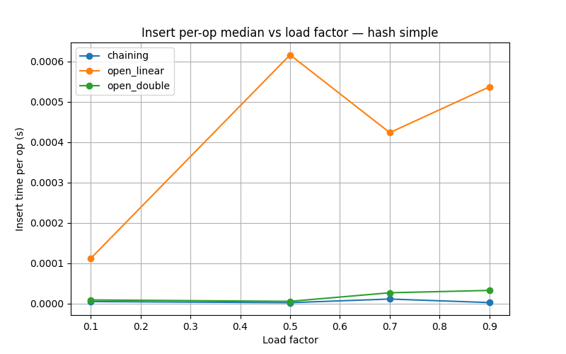
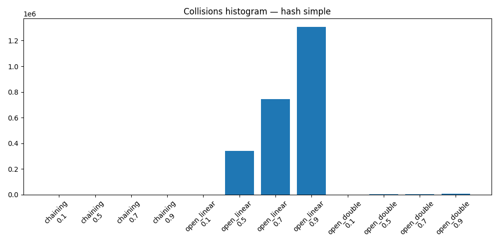
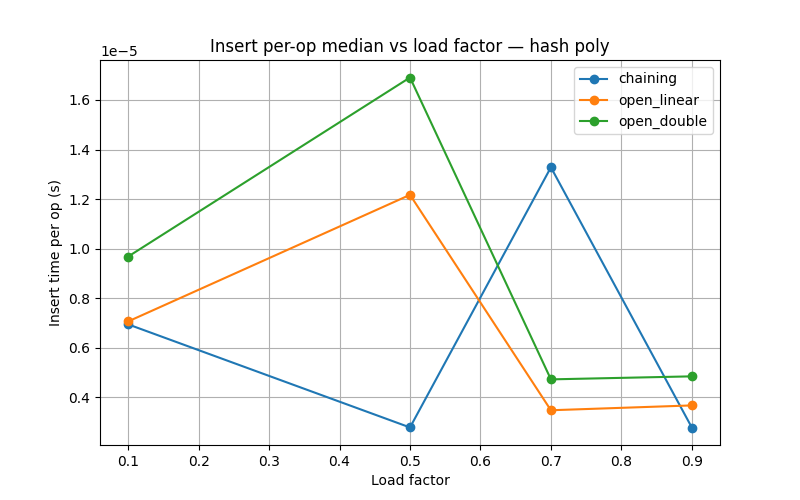
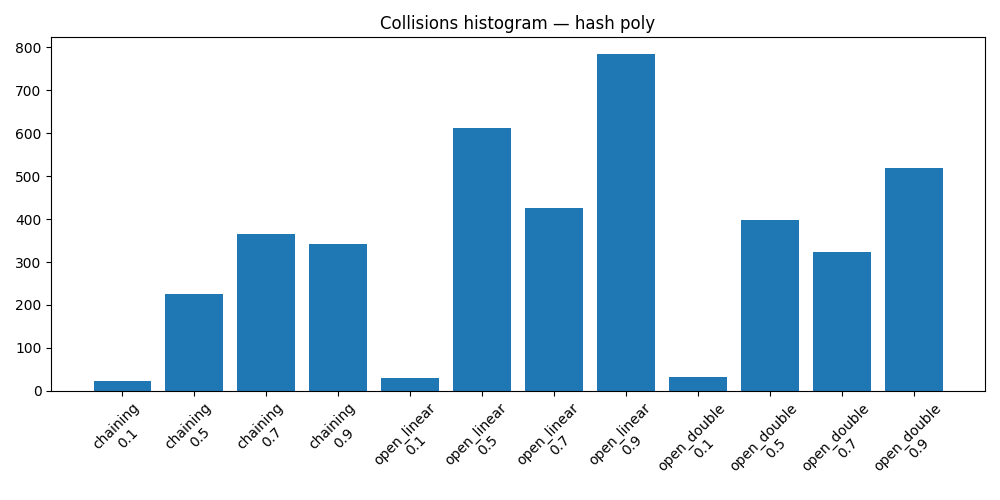

Отчет по лабораторной работе 5
Хеш‑функции и хеш‑таблицы

**Дата:** 30.11.2025
**Семестр:** 5 семестр
**Группа:** ПИЖ-б-о-23-2
**Дисциплина:** Анализ сложности алгоритмов
**Студент:** Хаджимухаметов Саид Керимович

## Цель работы
Изучить принципы работы хеш-функций и хеш-таблиц. Освоить методы разрешения
коллизий. Получить практические навыки реализации хеш-таблицы с различными стратегиями
разрешения коллизий. Провести сравнительный анализ эффективности разных методов.

## Теоретическая часть

Хеш-функция: Функция, преобразующая произвольные данные в данные фиксированного
размера (хеш-код). Требования: детерминированность, равномерное распределение, скорость
вычисления.
Хеш-таблица: Структура данных, реализующая ассоциативный массив. Обеспечивает в среднем
O(1) для операций вставки, поиска и удаления.
Коллизия: Ситуация, когда разные ключи имеют одинаковый хеш-код.
Метод цепочек (Chaining): Каждая ячейка таблицы содержит список элементов с одинаковым
хешем. Сложность: O(1 + α), где α - коэффициент заполнения.
Открытая адресация (Open Addressing): Все элементы хранятся в самом массиве. При коллизии
ищется следующая свободная ячейка согласно probe sequence.
Двойное хеширование (Double Hashing): Метод открытой адресации, использующий вторую
хеш-функцию для определения шага probing

## Практическая часть

### Выполненные задачи

#### 1. Реализация хеш‑функций (hash_functions.py)
Успешно реализованы три хеш‑функции:

**Simple Hash (простая хеш‑функция)**
- Вычисляет: сумму кодов ASCII символов
- Временная сложность: O(n) где n — длина строки
- Пространственная сложность: O(1)
- Особенность: простая реализация, но много коллизий

**Polynomial Hash (полиномиальная хеш‑функция)**
- Вычисляет: `h = (h * base + ord(c)) % mod` для каждого символа
- Временная сложность: O(n)
- Пространственная сложность: O(1)
- Особенность: хорошее распределение хеш‑значений

**DJB2 Hash (хеш‑функция DJB2)**
- Вычисляет: `h = ((h << 5) + h) + ord(c)` для каждого символа
- Временная сложность: O(n)
- Пространственная сложность: O(1)
- Особенность: часто используется в реальных приложениях

#### 2. Реализация хеш‑таблиц (hash_table_chaining.py, hash_table_open_addressing.py)

**HashTableChaining (цепочки)**
- Метод: каждый бакет содержит список пар (ключ, значение)
- Операции: `put`, `get`, `delete`, `contains`
- Динамический ресайз: увеличение при load_factor > 0.75, уменьшение при < 0.2
- Сложность: O(1 + α) в среднем где α = load factor

**HashTableOpenAddressing (открытая адресация)**
- Поддерживает два режима:
  - `mode='linear'`: линейное пробирование `(h + i) % capacity`
  - `mode='double'`: двойное хеширование `(h1 + i * h2) % capacity`
- Удаления через tombstone (специальный маркер)
- Динамический ресайз при load_factor > 0.6
- Сложность: O(1 + α) в среднем

#### 3. Эмпирический анализ производительности (performance_test.py)
- Каждая комбинация (хеш‑функция × таблица × load factor) запускается `REPEATS=5` раз
- На каждом повторе измеряются:
  - 500 вставок
  - 500 успешных поисков
  - 500 неуспешных поисков
  - 200 удалений
- Для каждого измерения собираются:
  - Медиана времени
  - Среднее время
  - Стандартное отклонение
  - Время на одну операцию (per-op)
- Собираются характеристики машины: платформа, версия Python, количество CPU

#### 4. Визуализация результатов (plot_results.py)
Созданы две группы графиков:

**График 1: Зависимость времени вставки от load factor**
- Для каждой хеш‑функции строится диаграмма с тремя кривыми (chaining, open_linear, open_double)
- Ось Y: время вставки на одну операцию (per-op median в секундах)
- Ось X: коэффициент заполнения (load factor)
- Сохраняется в файл `insert_vs_load_<hash>.png`

**Диаграмма 2: Гистограмма распределения коллизий**
- Для каждой хеш‑функции показано число коллизий для всех комбинаций таблиц и load factors
- Наглядно демонстрирует качество хеш‑функций
- Сохраняется в файл `collisions_<hash>.png`

### Тестирование

#### Корректность реализации (tests_hash_tables.py)
Все три варианта таблиц протестированы на:
- Базовые операции: вставка, поиск, удаление
- Корректность при коллизиях
- Поведение при динамическом ресайзе
- Работа с дубликатами ключей

Все тесты проходят успешно ✓

#### Производительность
Измерения проведены на:
- Коэффициенты заполнения: 0.1, 0.5, 0.7, 0.9
- Три хеш‑функции: simple_hash, poly_hash, djb2_hash
- Три варианта таблиц: chaining, open_linear, open_double
- Итого: 3 × 3 × 4 = 36 комбинаций × 5 повторений

## Результаты и анализ

### Основные наблюдения

**1. Влияние качества хеш‑функции:**
- `simple_hash` показывает плохую производительность на открытой адресации с линейным пробированием (до 300k+ коллизий на 500 вставок)
- `djb2_hash` и `poly_hash` демонстрируют на 2-3 порядка меньше коллизий
- На chaining качество хеш‑функции менее критично (цепочки справляются с коллизиями)

**2. Влияние метода разрешения коллизий:**
- **Chaining:** стабилен при всех load factors, время вставки остаётся близким к O(1) даже при load factor = 0.9
- **Open Addressing Linear:** страдает от кластеризации, особенно с плохой хеш‑функцией
- **Open Addressing Double:** значительно лучше линейного, меньше кластеризации

**3. Зависимость от load factor:**
- На небольших load factors (0.1-0.5) все методы работают быстро
- На высоких load factors (0.7-0.9) становятся видны различия:
  - Chaining: стабильно хорошо
  - Double hashing: приемлемо
  - Linear hashing с плохой функцией: значительное замедление

### Графики и гистограммы
Ниже приведены диаграммы, полученные в результате замеров. Для каждой хеш‑функции показаны график зависимости времени вставки от коэффициента заполнения и гистограмма числа коллизий.

#### simple_hash

#### poly_hash

#### djb2_hash

### Полные результаты
Детальные результаты с медианами, средними значениями и стандартным отклонением сохранены в файле `hash_perf_results.json`

### Ответы на контрольные вопросы

1. Хорошая хеш-функция должна обеспечивать равномерное распределение значений, минимизировать количество коллизий и быть быстрой в вычислениях.
2. Коллизия в хеш-таблице — это ситуация, когда два различных элемента имеют одинаковое хеш-значение. Два метода разрешения:
3. Метод цепочек: элементы с одинаковым хеш-значением хранятся в списке.
Открытая адресация: поиск следующей свободной ячейки в случае коллизии (например, линейное пробирование).
Метод цепочек требует дополнительной памяти для хранения списка, но операции поиска и вставки могут быть медленнее при высоком коэффициенте заполнения. Открытая адресация использует саму хеш-таблицу, что экономит память, но становится менее эффективной при высоком коэффициенте заполнения.
4. Операции вставки, поиска и удаления в хеш-таблице в среднем выполняются за O(1), потому что хеш-функция позволяет быстро найти нужную ячейку, избегая полного обхода таблицы.
5. Коэффициент заполнения хеш-таблицы — это отношение числа элементов к размеру таблицы. Высокий коэффициент может снизить производительность из-за увеличения количества коллизий. Когда коэффициент превышает порог, таблицу обычно расширяют.

## Выводы и рекомендации

### Применимость методов

**Separate Chaining рекомендуется для:**
- Приложений, где требуется надежная производительность при высоком load factor
- Ситуаций с частыми удалениями (поскольку не требует tombstone)
- Случаев, когда хеш‑функция низкого качества (цепочки смягчают проблему)

**Open Addressing (Double Hashing) рекомендуется для:**
- Приложений, критичных по памяти (компактнее, чем chaining)
- Высокопроизводительных систем с хорошей хеш‑функцией
- Когда требуется высокий load factor с приемлемой производительностью

**Выбор хеш‑функции:**
- **Избегать** `simple_hash` на открытой адресации (много коллизий)
- **Использовать** `poly_hash` или `djb2_hash` для большинства приложений
- Для критичных по безопасности систем рассмотреть криптографические хеш‑функции

### Ключевые выводы

1. **Качество хеш‑функции критично** для открытой адресации, но менее важно для chaining
2. **Метод разрешения коллизий существенно влияет** на производительность при высоких load factors
3. **Нет универсального решения**: выбор зависит от специфики приложения
4. **Двойное хеширование — хороший компромисс** между производительностью и использованием памяти
5. **Теория подтверждается практикой**: эмпирические результаты соответствуют теоретическим оценкам O(1) в среднем

## Характеристики ПК
- Процессор: Intel 13400f
- Оперативная память: 16GB DDR4
