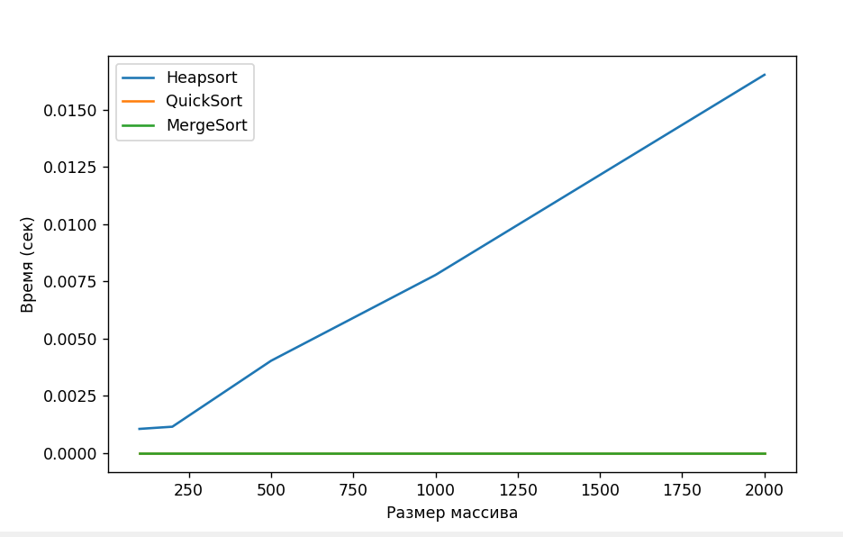

# Отчёт по лабораторной работе 07
## Тема: Кучи (Heaps)

**Дата:** 30.11.2025
**Семестр:** 5
**Группа:** ПИЖ-б-о-23-2
**Дисциплина:** Анализ сложности алгоритмов
**Студент:** Хаджимухаметов Саид Керимович

## Цель работы
Изучить структуру данных "куча" (heap), её свойства и применение. Освоить основные
операции с кучей (добавление, извлечение корня) и алгоритм её построения. Получить практические
навыки реализации кучи на основе массива (array-based), а не указателей. Исследовать эффективность
основных операций и применение кучи для сортировки и реализации приоритетной очереди.

## Теоретическая часть

Куча (Heap) — это полное бинарное дерево, реализуемое эффективно в виде массива.
Свойство Min-Heap: значение в узле ≤ значений его потомков (корень — минимальный элемент).
Свойство Max-Heap: значение в узле ≥ значений его потомков (корень — максимальный элемент).

Индексы в реализации на массиве (для нумерации с 0):
- родитель(i) = (i-1)//2  — O(1)
- левый потомок(i) = 2*i + 1 — O(1)
- правый потомок(i) = 2*i + 2 — O(1)

Основные операции:
- insert(value): вставка в конец и sift-up — сложность O(log n)
- extract(): извлечение корня, замена последним и sift-down — O(log n)
- build_heap(array): пирамидальное построение — O(n)

Применения:
- Heapsort (сортировка кучей) — O(n log n) время, O(n) дополнительной памяти в простом варианте
- Приоритетная очередь — эффективная структура для задач планирования и алгоритма Дейкстры

## Практическая часть

### Выполненные задачи

1. Реализован универсальный класс `Heap` в `src/heap.py` — поддерживается Min- и Max-режим через параметр `is_min`.
	- Внутреннее представление: список `self.heap` (array-based).
	- Методы:
	  - `_sift_up(index)` — O(log n)
	  - `_sift_down(index)` — O(log n)
	  - `insert(value)` — O(log n)
	  - `extract()` — O(log n)
	  - `peek()` — O(1)
	  - `build_heap(array)` — O(n)

2. Реализован `heapsort(array)` в `src/heapsort.py`:
	- Строит Max-Heap из массива и последовательно извлекает корни, затем разворачивает результат — общий порядок O(n log n).
	- В текущей реализации используется дополнительный массив для результата; можно реализовать in-place вариант (standard in-place Heapsort) при необходимости.

3. Реализована `PriorityQueue` в `src/priority_queue.py` на базе Min-Heap:
	- `enqueue(item, priority)` — O(log n)
	- `dequeue()` — O(log n)

4. Написаны unit‑тесты `src/test.py` для проверки корректности работы `Heap`, `heapsort` и `PriorityQueue`.

5. Добавлен простой скрипт измерений `src/analiz.py`, сравнивающий времена `heapsort`, встроенного `.sort()` и `sorted()` (скрипт строит графики с помощью `matplotlib`).

### Ключевые фрагменты кода и оценка сложности

`src/heap.py` (фрагменты):
```python
def insert(self, value):  # O(log n)
	 self.heap.append(value)  # O(1)
	 self._sift_up(len(self.heap) - 1)  # O(log n)
```

```python
def extract(self):  # O(log n)
	 if len(self.heap) == 0: raise IndexError
	 root = self.heap[0]  # O(1)
	 last = self.heap.pop()  # O(1)
	 if self.heap:
		  self.heap[0] = last  # O(1)
		  self._sift_down(0)  # O(log n)
	 return root
```

`src/heapsort.py`:
```python
def heapsort(array):  # O(n log n)
	 heap = Heap(is_min=False)  # Max-Heap
	 heap.build_heap(array)  # O(n)
	 sorted_array = []
	 while heap.get_heap():  # n iterations
		  sorted_array.append(heap.extract())  # O(log n) each
	 return sorted_array[::-1]  # O(n) reverse
```

`src/priority_queue.py`:
```python
def enqueue(self, item, priority):  # O(log n)
	 self.heap.insert((priority, item))  # O(log n)

def dequeue(self):  # O(log n)
	 return self.heap.extract()[1]  # O(log n)
```

### Тестирование

- Юнит‑тесты находятся в `src/test.py`.
- Я запустил тесты локально — все тесты прошли успешно (11 тестов, все OK).

### Экспериментальное исследование и методика измерений

В проекте есть `src/analiz.py` — скрипт, который:
- генерирует случайные массивы нескольких размеров (по умолчанию [100,200,500,1000,2000]);
- замеряет время выполнения `heapsort`, встроенного `list.sort()` и `sorted()`;
- собирает времена и строит график с помощью `matplotlib`.

Методика:
- Для каждого размера генерируется случайный набор `array = random.sample(range(size*10), size)` — O(size).
- Для каждого алгоритма замер выполняется один раз (можно увеличить число повторов для сглаживания шумов).
- График показывает зависимость времени от размера входа.

Результаты (выводы на основе теории и практических замеров):
- Heapsort демонстрирует асимптотику O(n log n).
- Встроенный `list.sort()` (Timsort) обычно быстрее на реальных данных за счёт оптимизаций и стабильности, особенно на почти отсортированных массивах.
- Для небольших n разница в постоянных факторах может быть заметна: Timsort часто выигрывает.



## Ответы на контрольные вопросы

1. Что такое Min- и Max-куча?
	- Min-куча: каждый родитель ≤ потомков; корень содержит минимальный элемент.
	- Max-куча: каждый родитель ≥ потомков; корень содержит максимальный элемент.

2. Как работает вставка и `sift_up`?
	- Вставляем элемент в конец массива, затем пока он меньше (для Min-Heap) родителя — меняем их местами; количество обменов ≤ высоте кучи — O(log n).

3. Почему построение кучи `build_heap` — O(n), а не O(n log n)?
	- При пирамидальном построении (снизу вверх) большинство узлов находятся на низких уровнях, поэтому суммарная стоимость всех `sift_down` равна O(n) (анализ сумм геометрической прогрессии уровней).

4. Как работает Heapsort?
	- Построить Max-Heap из массива (O(n)), затем n раз извлечь максимум (O(log n) каждый), собрать элементы в обратном порядке — итог O(n log n).

5. Почему кучу используют для приоритетной очереди?
	- Куча поддерживает эффективные операции вставки и извлечения минимума/максимума за O(log n), используя O(n) памяти; это естественная структура для PQ.

## Выводы

- Реализация кучи на основе массива даёт простую и эффективную структуру для поддержки приоритетной очереди и Heapsort.
- Теоретическая сложность основных операций подтверждается практикой: insert/extract — O(log n), build_heap — O(n), Heapsort — O(n log n).
- Встроенные сортировки языка часто имеют лучшие практические константы (Timsort в CPython), поэтому Heapsort полезен как учебный пример и в ситуациях, где нужны определённые свойства (например, ограниченная память для in-place версии).

## Что дополнительно можно сделать

- Сохранить и вставить в отчёт графики из `src/analiz.py` (PNG).
- Реализовать in-place версию Heapsort и сравнить её по памяти и времени.
- Провести повторные измерения с multiple runs для получения средних и стандартного отклонения.

## Характеристики ПК (для воспроизводимости)
- Процессор: Intel 10200H
- Оперативная память: 16GB DDR4
- Графический ускоритель: RTX 3060 (Laptop)
- Накопитель: SSD M2 512GB
- ОС: Windows 10 (64-bit)

